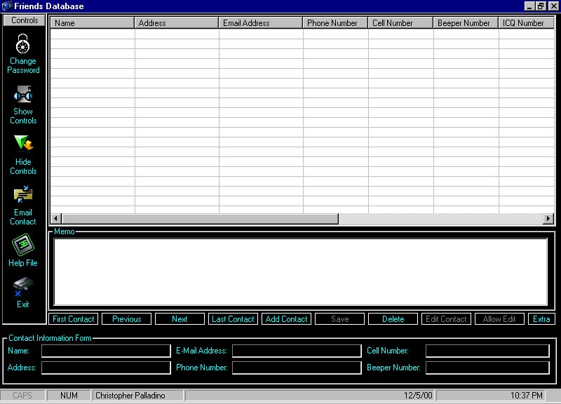



## Friends Database

### Description

UPDATED: Added better error handling just to be safe and neater... Also added more sound so all commands have a sound and upon loading a 3 second wav plays also... Great for learning how to add sound to enhance your program...Great for newbies to learn from...My first ADO database, i learned from tutorials on here specifically from Jerry Barnes so i think this would be great for people new to ADO databases to learn from but i suggest finding Jerry Barnes ADO For beginners source because it is incredibly commented on and will surely have you creating ADO within 20 minutes. I tried my best to eliminate any bugs but of course there has to be some somewhere... I also used sheridans active listbar for this program, the ocx is packed in witht he zip. Please let me know if i didn't include a needed ocx,file or just if something doesn't work right so i can fix or at least try to fix it. This took me awhile to make so please at least vote for me. Fixed a bug witht he extra button caused by a incorrectly placed setfocus, also fixed abug with the edit option displaying when save was pressed and causing an eof and bof error after the person tried to edit after re-opening the database later. Fixed a lot more bugs in this newer zip. -- IMPORTANT: Password for login is chris
 
### More Info
 

             |
---                |---
**Submitted On**   |2000-12-07 10:49:38
**By**             |[Chris ](https://github.com/Planet-Source-Code/PSCIndex/blob/master/ByAuthor/chris.md)
**Level**          |Intermediate
**User Rating**    |4.8 (38 globes from 8 users)
**Compatibility**  |VB 6\.0
**Category**       |[Databases/ Data Access/ DAO/ ADO](https://github.com/Planet-Source-Code/PSCIndex/blob/master/ByCategory/databases-data-access-dao-ado__1-6.md)
**World**          |[Visual Basic](https://github.com/Planet-Source-Code/PSCIndex/blob/master/ByWorld/visual-basic.md)
**Archive File**   |[CODE\_UPLOAD124281272000\.zip](https://github.com/Planet-Source-Code/chris-friends-database__1-13361/archive/master.zip)

